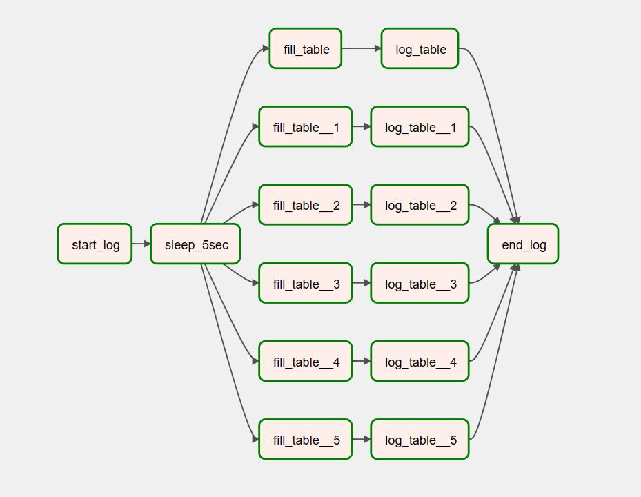
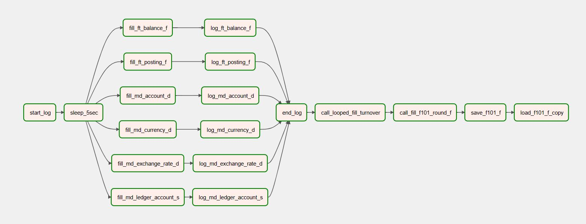
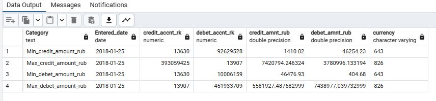
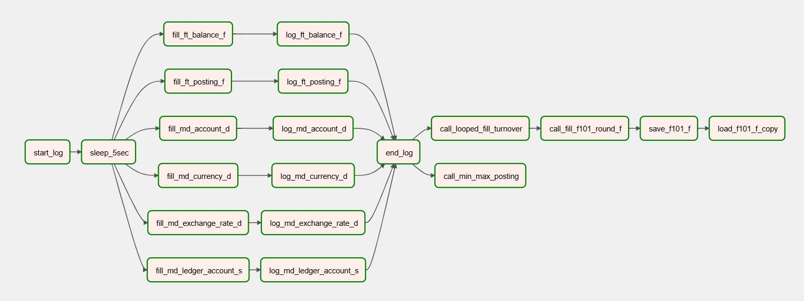

<a name="readme-top"></a>
# Проектное задание: Data Engineering


## Навигация
* [Задание 1.1](#задание-11)    
  * [Демо 1.1](#демо-11)  
  * [Подготовка базы данных PostgreSQL](#подготовка-базы-данных-postgresql)  
  * [Airflow DAG 1.1](#airflow-dag-11)  
* [Задание 1.2](#задание-12)
  * [Демо 1.2](#демо-12)  
  * [Дополнительные таблицы и процедуры в PostgreSQL](#дополнительные-таблицы-и-процедуры-в-postgresql)
  * [Airflow DAG 1.2](#airflow-dag-12) 
* [Задание 1.3](#задание-13)
  * [Демо 1.3](#демо-13)
  * [Реализация по заданию 1.3](#реализация-по-заданию-13)
  * [Логи](#логи)
  * [Airflow DAG 1.3](#airflow-dag-13)
* [Задание 1.4](#задание-14)
  * [Демо 1.4](#демо-14)
  * [Реализация по заданию 1.4](#реализация-по-заданию-14)
  * [Airflow DAG 1.4](#airflow-dag-14)
* [Задание 2.1](#задание-21)
  * [Демо 2.1](#демо-21)
  * [Настройка среды](#настройка-среды)
    * [Установка Spark](#установка-spark)
    * [Установка и настройка Jupyter Notebook](#установка-и-настройка-jupyter-notebook)
    * [Jupyter notebook Themes](#jupyter-notebook-themes)
  * [Реализация по заданию 2.1](#реализация-по-заданию-21)
* [Инструменты](#инструменты)
* [Источники данных](#источники-данных)
* [Запуск контейнеров](#запуск-контейнеров)


<p align="right">(<a href="#readme-top">back to top</a>)</p>

## Задание 1.1
<details> 
  <summary>Задание 1.1 </summary>
Разработать ETL-процесс для загрузки «банковских» данных из csv-файлов в соответствующие таблицы 
СУБД Oracle или PostgreSQL. Покрыть данный процесс логированием этапов работы и всевозможной 
дополнительной статистикой (на усмотрение вашей фантазии). В исходных файлах могут быть ошибки в 
виде некорректных форматах значений. Но глядя на эти значения вам будет понятно, какие значения 
имеются в виду.


#### Исходные данные:  
Данные из 6 таблиц в виде excel-файлов:  
`md_ledger_account_s` – справочник балансовых счётов;  
`md_account_d` – информация о счетах клиентов;  
`ft_balance_f` – остатки средств на счетах;  
`ft_posting_f` – проводки (движения средств) по счетам;  
`md_currency_d` – справочник валют;  
`md_exchange_rate_d` – курсы валют.  

</details>


<p align="right">(<a href="#readme-top">back to top</a>)</p>   

### Демо 1.1

Ссылка на видеозапись демонстрации:  [Demo Video](https://drive.google.com/file/d/19JQVqrtBoD1C89CvFrhccjgah0NizC2F/view?usp=sharing)


<p align="right">(<a href="#readme-top">back to top</a>)</p>

### Подготовка базы данных PostgreSQL

В pgAdmin4 создать поодключение к базе данных:  
Name  `neo_db_pg`   
Host `neo_db_pg`  (или по имени сервиса: `postgres-db`)  
User / Pass -  `admin / admin`  

#### Создадим схемы и таблицы
Файл `creates_1_1.sql` в корневой папке проекта содержит необходимые инструкции.

- Создадим схемы LOGS и DS
- Создадим в схеме DS таблицы, которые будем наполнять данными
- В схеме LOGS создадим таблицы для записи логов

> При выполнении задания 1.2 были изменены типы полей в таблицах схемы DS для приведения в соответствие со структурой таблиц, представленной в задании.  
> Финальные инструкции для создания таблиц слоя DS - `create_1_1_changed_types.sql`.  
> Эта корректировка не повлияла на процесс загрузки данных из файлов csv в слой DS.   


<p align="right">(<a href="#readme-top">back to top</a>)</p>

### Airflow DAG 1.1

Добавляем подключение к postgres  
Name  `neo_db_pg`  
Host `neo_db_pg`  (или по имени сервиса: `postgres-db`)  
Schema `neo_db_pg`  
User / Pass -  `admin / admin`

Код с описанием процесса на Python:
`airflow/dags/neo_dag_1_1.py`

Визуализация графа:




Логи после завершения процесса загрузки выглядят так:


<p align="right">(<a href="#readme-top">back to top</a>)</p>


## Задание 1.2
<details> 
  <summary>Задание 1.2 </summary>

После того как детальный слой «DS» успешно наполнен исходными данными из файлов – нужно рассчитать витрины данных в слое «DM»: витрину оборотов и витрину 101-й отчётной формы.  

Для этого вам сперва необходимо построить витрину оборотов «DM.DM_ACCOUNT_TURNOVER_F». А именно, посчитать за каждый день января 2018 года кредитовые и дебетовые обороты по счетам с помощью Oracle-пакета dm.fill_account_turnover_f или с помощью аналогичной PostgreSQL-процедуры.

Затем вы узнаёте от Аналитика в банке, что пакет (или процедуру) расчёта витрины 101-й формы «dm.fill_f101_round_f» необходимо доработать. Необходимо сделать расчёт полей витрины «dm.dm_f101_round_f» по формулам:

`BALANCE_OUT_RUB`  
для счетов с CHARACTERISTIC = 'A' и currency_code '643' рассчитать   
`BALANCE_OUT_RUB = BALANCE_IN_RUB - TURN_CRE_RUB + TURN_DEB_RUB;`  

для счетов с CHARACTERISTIC = 'A' и currency_code '810' рассчитать   
`BALANCE_OUT_RUB = BALANCE_IN_RUB - TURN_CRE_RUB + TURN_DEB_RUB;`  

для счетов с CHARACTERISTIC = 'P' и currency_code '643' рассчитать   
`BALANCE_OUT_RUB = BALANCE_IN_RUB + TURN_CRE_RUB - TURN_DEB_RUB;`  

для счетов с CHARACTERISTIC = 'P' и currency_code '810' рассчитать   
`BALANCE_OUT_RUB = BALANCE_IN_RUB + TURN_CRE_RUB - TURN_DEB_RUB;`  

`BALANCE_OUT_VAL`  
для счетов с CHARACTERISTIC = 'A' и currency_code не '643' и не '810' рассчитать   
`BALANCE_OUT_VAL = BALANCE_IN_VAL - TURN_CRE_VAL + TURN_DEB_VAL;`  

для счетов с CHARACTERISTIC = 'P' и currency_code не '643' и не '810'  рассчитать   
`BALANCE_OUT_VAL = BALANCE_IN_VAL + TURN_CRE_VAL - TURN_DEB_VAL;`  

`BALANCE_OUT_TOTAL`  
рассчитать `BALANCE_OUT_TOTAL как BALANCE_OUT_VAL + BALANCE_OUT_RUB`  

Обратите внимание, что в предоставленных вам пакетах (процедурах) есть процедура логирования, под них нужно создать соответствующие таблицы или реализовать собственный процесс логирования расчёта витрин – это будет только плюсом.

</details>


<p align="right">(<a href="#readme-top">back to top</a>)</p>   

### Демо 1.2

Ссылка на видеозапись демонстрации:  [Demo Video](https://drive.google.com/file/d/1J-Fqdxr4wxQfgZIWSTpmstrSkot-G6sg/view?usp=sharing)

<p align="right">(<a href="#readme-top">back to top</a>)</p>  


### Дополнительные таблицы и процедуры в PostgreSQL

Файл `creates_1_2.sql` в корневой папке проекта содержит необходимые инструкции.   

- Создадим схему `DM`  
- Создадим таблицы `DM.DM_ACCOUNT_TURNOVER_F` и `DM.DM_F101_ROUND_F`  
- Создадим таблицу для логов `dm.lg_messages`  
- Создадим хранимые процедуры через интерфейс pgAdmin4 или из терминала.  
Код для процедур находится в папке `procedures`:  
  - `procedure_writeog.sql`  
  - `proc_fill_account_turnover_f.sql`  
  - `proc_looped_fill_turnover.sql`  
  - `proc_fill_f101_round_f.sql`  


<p align="right">(<a href="#readme-top">back to top</a>)</p>  

### Airflow DAG 1.2

Код с описанием процесса на Python:
`airflow/dags/neo_dag_1_2.py`  

Визуализация графа:


<p align="right">(<a href="#readme-top">back to top</a>)</p>  

## Задание 1.3
<details> 
  <summary>Задание 1.3 </summary>

Выполнив предыдущие 2 задачи вам удалось рассчитать отчётную форму 101. Менеджер проекта доволен, ЦБ получил отчёт, руководство банка тоже довольно. Теперь необходимо выгрузить эти данные в формате, который бы позволил легко обмениваться ими между отделами. Один из таких форматов – CSV.

Напишите скрипт, который позволит выгрузить данные из витрины «dm. dm _f101_round_f» в csv-файл, первой строкой должны быть наименования колонок таблицы.

Убедитесь, что данные выгружаются в корректном формате и напишите скрипт, который позволит импортировать их обратно в БД. Поменяйте пару значений в выгруженном csv-файле и загрузите его в копию таблицы 101-формы «dm. dm _f101_round_f_v2».

Постарайтесь покрыть данные процессы простым логированием. Скрипты можно написать на Python / Scala / Java.


</details>


<p align="right">(<a href="#readme-top">back to top</a>)</p> 

### Демо 1.3

Ссылка на видеозапись демонстрации:  [Demo Video](https://drive.google.com/file/d/16eHrP4PHUgH1a3FHUBMbzdApqPtpRPqg/view?usp=sharing)

<p align="right">(<a href="#readme-top">back to top</a>)</p>  

### Реализация по заданию 1.3

Данные из витрины `dm.dm _f101_round_f` выгружаем в csv-файл с помощью запроса `COPY ... TO ...` и метода psycopg2.copy_expert .
Выгрузку запускает задача `save_f101_f` внутри общего DAGа.

Аналогично загружаем содержимое csv-файла в таблицу `dm.dm _f101_round_f_v2` (`COPY ... FROM ...`), предварительно создав ее как копию таблицы `dm.dm _f101_round_f`.  
Загрузка csv-файла в таблицу происходит в задаче `load_f101_f_copy`.


<p align="right">(<a href="#readme-top">back to top</a>)</p>  

### Логи

Для логирования я воспользовалась процедурой `dm.writelog` из предыдущего задания.
Я немного ее дополнила и оформила в виде новой процедуры `logs.write_log_info` в схеме `LOGS`.
Из-за изменения логирования процедуры из предыдущего задания тоже скорректированы (только в части вызова `logs.write_log_info`).  
Для удобства проверки задания я разместила код процедур в отдельной папке проекта - `procedures_v2`. В самой БД я пересоздала их.  
Для записи логов создана таблица `LOGS.LOG_INFO`, запрос на создание таблицы - `create_1_3_log_info.sql` в корне проекта.


Теперь в таблицу логов `LOGS.LOG_INFO` пишутся события на протяжении всего процесса выполнения DAGа с "реквизитами" из DAGа:  
`dag_id`, `run_id`, `logical_date`, `task_id`.


<p align="right">(<a href="#readme-top">back to top</a>)</p>  

### Airflow DAG 1.3

Код с описанием процесса на Python:
`airflow/dags/neo_dag_1_3.py`  


Визуализация графа:



<p align="right">(<a href="#readme-top">back to top</a>)</p>  

## Задание 1.4
<details> 
  <summary>Задание 1.4 </summary>

Создайте функцию (в Oracle или PostgreSQL), которая будет принимать дату, а возвращать эту дату и информацию о максимальной и минимальной сумме проводки по кредиту и по дебету за переданную дату. То есть эти значения надо вычислять на основании данных в таблице «ds.ft_posting_f».

Напишите скрипт на одном из 3-х языков (Python / Scala / Java), который будет вызывать разработанную ранее функцию и её ответ сохранять в csv-формате.


</details>


<p align="right">(<a href="#readme-top">back to top</a>)</p> 

### Демо 1.4

Ссылка на видеозапись демонстрации:  [Demo Video](https://drive.google.com/file/d/1n7tuke9BFJiZfBsiB9oWnbn6LjOXjNPt/view?usp=sharing)

<p align="right">(<a href="#readme-top">back to top</a>)</p>  


### Реализация по заданию 1.4

В проводках в таблице `ds.ft_posting_f` суммы указаны в различных валютах. Для нахождения минимальной и максимальной проводки по дебету и кредиту пересчитаем суммы в рубли по соответствующему курсу.
Для этого понадобится соединение с таблицами `ds.md_account_d` и `ds.md_exchange_rate`.  
Обернем запрос в функцию plpgsql, принимающую на вход дату. Код функции `ds.min_max_posting` размещен в файле `create_function_1_4.sql` в корне проекта. 

Результат вызова функции - таблица, где каждая строка удовлетворяет одному из условий.
Например, на изображении ниже результат на дату 2018-01-25.   
Строка с признаком `Min_credit_amount_rub` отображает проводку, которая имеет минимальную сумму в рублях по кредиту за указанную дату. 




<p align="right">(<a href="#readme-top">back to top</a>)</p>  


### Airflow DAG 1.4

Код с описанием процесса на Python:
`airflow/dags/neo_dag_1_4.py`  

Визуализация графа:



<p align="right">(<a href="#readme-top">back to top</a>)</p>  

## Задание 2.1
<details> 
  <summary>Задание 2.1 </summary>

В помощь, архитектор поделился с вами скриптами по настройке среды разработки со Spark. По мимо этого он отправил вам файл `Athletes.csv` и попросил выполнить несколько запросов для проверки работоспособности Spark-приложений.

Настройте виртуальную машину с Ubuntu, установите на неё Spark (PySpark по желанию). Так же вы можете установить среду разработки - например Jupyter. Команды по установке и первичной настройке находятся в файле "ubuntu_commands.txt", рядом с ним ещё должен быть прикреплён файл «PySpark_Simple_example.txt».

Проверочные задачи:

  1. Сгенерировать DataFrame из трёх колонок `(row_id, discipline, season)` - олимпийские дисциплины по сезонам.  
`row_id` - число порядкового номера строки;  
`discipline` - наименование олимпиский дисциплины на английском (полностью маленькими буквами);  
`season` - сезон дисциплины (summer / winter);  
<br/>
*Укажите не мнее чем по 5 дисциплин для каждого сезона.
Сохраните DataFrame в csv-файл, разделитель колонок табуляция, первая строка должна содержать название колонок.
<br/>
Данные должны быть сохранены в виде 1 csv-файла а не множества маленьких.

---
  2. Прочитайте исходный файл `Athletes.csv`.  
Посчитайте в разрезе дисциплин сколько всего спортсменов в каждой из дисциплин принимало участие.  
Результат сохраните в формате parquet.  

---

  3. Прочитайте исходный файл `Athletes.csv`.  
Посчитайте в разрезе дисциплин сколько всего спортсменов в каждой из дисциплин принимало участие.  
Получившийся результат нужно объединить с сгенерированным вами DataFrame из 1-го задания и в итоге вывести количество участников, только по тем дисциплинам, что есть в вашем сгенерированном DataFrame.  
Результат сохраните в формате parquet.  


</details>

<p align="right">(<a href="#readme-top">back to top</a>)</p>

### Демо 2.1

Ссылка на видеозапись демонстрации:  [Demo Video](https://drive.google.com/file/d/1TYvL5hCiSqhqiumC7ogv1W2NSrDS_FjT/view?usp=sharing)

<p align="right">(<a href="#readme-top">back to top</a>)</p>

### Настройка среды

Отправная точка - кластер hadoop на основе образа `apache/hadoop:3` (на текущий момент последняя версия 3.3.6) и `docker-compose.yaml`, взятого [здесь](https://hub.docker.com/r/apache/hadoop).
docker-compose.yaml находится в папке [Neo_project_1_1/hadoop_docker](hadoop_docker/docker-compose.yaml)

В файле [Neo_project_1_1/hadoop_docker/config](hadoop_docker/config)  добавим запись:  
```text
HDFS-SITE.XML_dfs.replication=1
HDFS-SITE.XML_dfs.namenode.name.dir=/opt/hadoop/dfs/name
HDFS-SITE.XML_dfs.datanode.data.dir=/opt/hadoop/dfs/data

```

#### Установка Spark
Переходим на ноду `resourcemanager` и устанавливаем Spark.  
Скачиваем и распаковываем [архив](https://dlcdn.apache.org/spark/spark-3.4.1/spark-3.4.1-bin-hadoop3.tgz):  

```shell
# Go to home folder
$ cd ~
 
# Download tarball
$ wget --no-check-certificate https://dlcdn.apache.org/spark/spark-3.4.1/spark-3.4.1-bin-hadoop3.tgz

# Extract
$ tar -zxf spark-3.4.1-bin-hadoop3.tgz
 
# Rename extracted folder to simple name
$ mv spark-3.4.1-bin-hadoop3/ spark

$ rm spark-3.4.1-bin-hadoop3.tgz
```

Добавим переменные окружения в файл `/opt/.bashrc`:  
```shell
export SPARK_HOME=/opt/hadoop/spark
export YARN_CONF_DIR=$HADOOP_HOME/etc/hadoop
export PATH=$PATH:$SPARK_HOME/bin:$JAVA_HOME/bin:$HADOOP_HOME/bin:$HADOOP_HOME/sbin
```

Применим настройки .bashrc:  
```shell
source .bashrc
```

Для проверки, что все работает можно запустить пример:

```shell
spark-submit --master yarn \
--num-executors 4 \
--executor-cores 2 \
--executor-memory 640M \
--class org.apache.spark.examples.JavaSparkPi \
~/spark/examples/jars/spark-examples_2.12-3.4.1.jar 100

```


<p align="right">(<a href="#readme-top">back to top</a>)</p> 

#### Установка и настройка Jupyter Notebook


Установим Python и virtualenv
```shell
sudo yum install python3-pip 
sudo pip3 install virtualenv
```

Создадим директорию, где будут храниться виртуальные окружения.
```shell
cd /opt
mkdir venv_space
cd venv_space
```
Внутри каталога, создаем виртуальную среду для Python. 
```shell
virtualenv venv_jupyter
```
До установки Jupyter понадобится активация виртуальной среды. 
```shell
source venv_jupyter/bin/activate
```

После активации виртуальной среды инсталлируем jupyter.
````shell
pip3 install jupyter
````
Заустить приложение можно командой:
````shell
jupyter notebook --ip 0.0.0.0 --no-browser --port=8888
````

Установим еще несколько переменных окружения (`/opt/.bashrc`):  
```shell
# Define env Python to use
export PYSPARK_PYTHON=/opt/venv_space/venv_jupyter/bin/python

# Define IPython driver
export PYSPARK_DRIVER_PYTHON=/opt/venv_space/venv_jupyter/bin/ipython3


```
Активируем виртуальное окружение venv_jupyter:

```shell
source /opt/venv_space/venv_jupyter/bin/activate
```
Установим необходимые python модули:
  * Py4J позволяет программам, работающим в интерпретаторе Python, динамически обращаться к объектам Java внутри JVM. Py4J также позволяет программам Java вызывать объекты Python.  
  * findspark - позволит импортировать pyspark как обычную python-библиотеку.  
```shell
pip3 install py4j
pip3 install findspark
```
Запустим интерактивный режим python (ввести python3) и выполним команды:
```pycon
>>> import findspark
>>> findspark.init('/opt/hadoop/spark')
>>> import pyspark
>>> quit()
```

Запустим Jupyter:

```shell
jupyter notebook --ip 0.0.0.0 --no-browser --port=8888
```

<p align="right">(<a href="#readme-top">back to top</a>)</p> 

#### Jupyter notebook Themes

Источник: https://github.com/dunovank/jupyter-themes/tree/master

```shell
# install jupyterthemes
pip install jupyterthemes

# upgrade to latest version
pip install --upgrade jupyterthemes
```
Устанавливаем тему `gruvbox-dark`:
```shell
jt -t gruvboxd
```

<p align="right">(<a href="#readme-top">back to top</a>)</p>

### Реализация по заданию 2.1

Для работы с jupyter notebook я создала директорию [Neo_project_1_1/hadoop_docker/notebooks](hadoop_docker/notebooks).  
Она примонтирована к контейнеру (`/opt/notebooks`).  
Здесь сохранен [notebook_2_1.ipynb](hadoop_docker/notebooks/notebook_2_1.ipynb) с выполненным заданием и исходный csv-файл.

При старте jupyter notebook укажем опцию `--notebook-dir /opt/notebooks`

```shell
# Start jupyter
jupyter notebook --no-browser --notebook-dir /opt/notebooks --ip=0.0.0.0 --port=8888
```


<p align="right">(<a href="#readme-top">back to top</a>)</p>

## Инструменты

- Apache Airflow 2.6.2
- Python 3.7
- PostgreSQL 14
- pgAdmin4 7.4
- Docker compose


<p align="right">(<a href="#readme-top">back to top</a>)</p>


## Источники данных

Исходные данные в формате csv находятся в папке проекта `airflow/dags/neo_data`


<div><p align="right">(<a href="#readme-top">back to top</a>)</p></div>


## Запуск контейнеров

Для запуска postgres и pgAdmin просто выполнить команду  
`docker compose up -d`  
находясь в папке `postgres` или указать путь к файлу docker-compose.yaml с помощью опции -f


Для Airflow    
Файл `docker-compose.yaml` взят из документации [здесь](https://airflow.apache.org/docs/apache-airflow/2.6.2/howto/docker-compose/index.html#fetching-docker-compose-yaml)   
Изменен только порт для веб-сервера и дописан доступ воркеру во внешнюю сеть, чтобы обеспечить доспуп к нашей базе postgresql.  
Инструкции по запуску контейнеров с сервисами Airflow так же можно найти в документации по ссылке выше.


<p align="right">(<a href="#readme-top">back to top</a>)</p>

