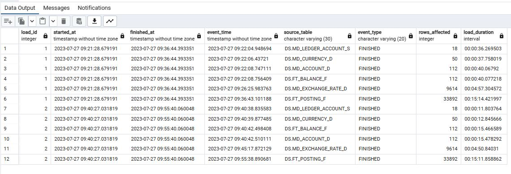

# Проектное задание: Data Engineering
## Задача 1.1

Разработать ETL-процесс для загрузки «банковских» данных из csv-файлов в соответствующие таблицы 
СУБД Oracle или PostgreSQL. Покрыть данный процесс логированием этапов работы и всевозможной 
дополнительной статистикой (на усмотрение вашей фантазии). В исходных файлах могут быть ошибки в 
виде некорректных форматах значений. Но глядя на эти значения вам будет понятно, какие значения 
имеются в виду.

## Навигация
* [Демо](#демо)
* [Инструменты](#инструменты)
* [Источники данных](#источники-данных)
* [Подготовка базы данных PostgreSQL](#подготовка-базы-данных-postgresql)
* [Airflow](#airflow)
* [Запуск контейнеров](#запуск-контейнеров)

(<a href="#readme-top">back to top</a>)

## Демо

Ссылка на видеозапись демонстрации:

[Demo Video](https://drive.google.com/drive/folders/1WyyQH9z0u-7FtLvH-rslwsaq3C2sUj1b?usp=sharing)

(<a href="#readme-top">back to top</a>)

## Инструменты

- Apache Airflow 2.6.2
- Python 3.7
- PostgreSQL 14
- pgAdmin4 7.4
- Docker compose

(<a href="#readme-top">back to top</a>)

## Источники данных

Исходные данные в формате csv находятся в папке проекта `airflow/dags/neo_data`

(<a href="#readme-top">back to top</a>)

## Подготовка базы данных PostgreSQL

В pgAdmin4 создать поодключение к базе данных:  
Name  `neo_db_pg`   
Host `neo_db_pg`  (или по имени сервиса: `postgres-db`)  
User / Pass -  `admin / admin`  

### Создадим схемы и таблицы
Файл `create.sql` в корневой папке проекта содержит необходимые инструкции.

- Создадим схемы LOGS и DS
- Создадим в схеме DS таблицы, которые будем наполнять данными
- В схеме LOGS создадим таблицы для записи логов

(<a href="#readme-top">back to top</a>)

## Airflow

Добавляем подключение к postgres
Name  `neo_db_pg`  
Host `neo_db_pg`  (или по имени сервиса: `postgres-db`)  
Schema `neo_db_pg`  
User / Pass -  `admin / admin`

Код с описанием процесса на Python:
`airflow/dags/neo_dag.py`

Визуализация графа:

Логи после завершения процесса загрузки выглядят так:

(<a href="#readme-top">back to top</a>)

## Запуск контейнеров

Для запуска postgres и pgAdmin просто выполнить команду  
`docker compose up -d`  
находясь в папке `postgres` или указать путь к файлу docker-compose.yaml с помощью опции -f

Для Airflow    
Файл `docker-compose.yaml` взят из документации [здесь](https://airflow.apache.org/docs/apache-airflow/2.6.2/howto/docker-compose/index.html#fetching-docker-compose-yaml)   
Изменен только порт для веб-сервера и дописан доступ воркеру во внешнюю сеть, чтобы обеспечить доспуп к нашей базе postgresql

(<a href="#readme-top">back to top</a>)

