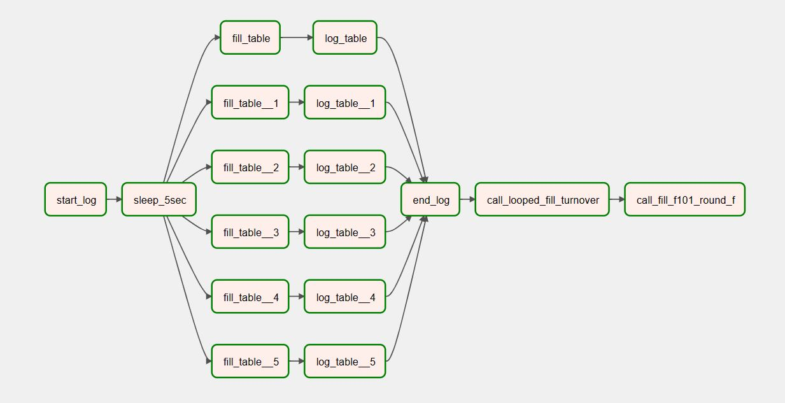

# Проектное задание: Data Engineering

## Навигация
* [Задание 1.1](#задание-11)    
  * [Демо 1.1](#демо-11)  
  * [Подготовка базы данных PostgreSQL](#подготовка-базы-данных-postgresql)  
  * [Airflow DAG 1.1](#airflow-dag-11)  
* [Задание 1.2](#задание-12)
  * [Демо 1.2](#демо-12)  
  * [Дополнительные таблицы и процедуры в PostgreSQL](#дополнительные-таблицы-и-процедуры-в-postgresql)
  * [Airflow DAG 1.2](#airflow-dag-12) 
* [Задание 1.3](#задание-13)
  * [Демо 1.3](#демо-13)
  * [Реализация по заданию](#реализация-по-заданию)
  * [Логи](#логи)
  * [Airflow DAG 1.3](#airflow-dag-13)
* [Инструменты](#инструменты)
* [Источники данных](#источники-данных)
* [Запуск контейнеров](#запуск-контейнеров)

(<a href="#readme-top">back to top</a>)

## Задание 1.1

 
  
Задание 1.1 

Разработать ETL-процесс для загрузки «банковских» данных из csv-файлов в соответствующие таблицы 
СУБД Oracle или PostgreSQL. Покрыть данный процесс логированием этапов работы и всевозможной 
дополнительной статистикой (на усмотрение вашей фантазии). В исходных файлах могут быть ошибки в 
виде некорректных форматах значений. Но глядя на эти значения вам будет понятно, какие значения 
имеются в виду.

#### Исходные данные:  
Данные из 6 таблиц в виде excel-файлов:  
`md_ledger_account_s` – справочник балансовых счётов;  
`md_account_d` – информация о счетах клиентов;  
`ft_balance_f` – остатки средств на счетах;  
`ft_posting_f` – проводки (движения средств) по счетам;  
`md_currency_d` – справочник валют;  
`md_exchange_rate_d` – курсы валют.  

(<a href="#readme-top">back to top</a>)
   

### Демо 1.1

Ссылка на видеозапись демонстрации:  [Demo Video](https://drive.google.com/file/d/19JQVqrtBoD1C89CvFrhccjgah0NizC2F/view?usp=sharing)

(<a href="#readme-top">back to top</a>)

### Подготовка базы данных PostgreSQL

В pgAdmin4 создать поодключение к базе данных:  
Name  `neo_db_pg`   
Host `neo_db_pg`  (или по имени сервиса: `postgres-db`)  
User / Pass -  `admin / admin`  

#### Создадим схемы и таблицы
Файл `creates_1_1.sql` в корневой папке проекта содержит необходимые инструкции.

- Создадим схемы LOGS и DS
- Создадим в схеме DS таблицы, которые будем наполнять данными
- В схеме LOGS создадим таблицы для записи логов

> При выполнении задания 1.2 были изменены типы полей в таблицах схемы DS для приведения в соответствие со структурой таблиц, представленной в задании.  
> Финальные инструкции для создания таблиц слоя DS - `create_1_1_changed_types.sql`.  
> Эта корректировка не повлияла на процесс загрузки данных из файлов csv в слой DS.   

(<a href="#readme-top">back to top</a>)

### Airflow DAG 1.1

Добавляем подключение к postgres  
Name  `neo_db_pg`  
Host `neo_db_pg`  (или по имени сервиса: `postgres-db`)  
Schema `neo_db_pg`  
User / Pass -  `admin / admin`

Код с описанием процесса на Python:
`airflow/dags/neo_dag_1_1.py`

Визуализация графа:

Логи после завершения процесса загрузки выглядят так:

(<a href="#readme-top">back to top</a>)

## Задание 1.2

 
  
Задание 1.2 

После того как детальный слой «DS» успешно наполнен исходными данными из файлов – нужно рассчитать витрины данных в слое «DM»: витрину оборотов и витрину 101-й отчётной формы.  

Для этого вам сперва необходимо построить витрину оборотов «DM.DM_ACCOUNT_TURNOVER_F». А именно, посчитать за каждый день января 2018 года кредитовые и дебетовые обороты по счетам с помощью Oracle-пакета dm.fill_account_turnover_f или с помощью аналогичной PostgreSQL-процедуры.

Затем вы узнаёте от Аналитика в банке, что пакет (или процедуру) расчёта витрины 101-й формы «dm.fill_f101_round_f» необходимо доработать. Необходимо сделать расчёт полей витрины «dm.dm_f101_round_f» по формулам:

`BALANCE_OUT_RUB`  
для счетов с CHARACTERISTIC = 'A' и currency_code '643' рассчитать   
`BALANCE_OUT_RUB = BALANCE_IN_RUB - TURN_CRE_RUB + TURN_DEB_RUB;`  

для счетов с CHARACTERISTIC = 'A' и currency_code '810' рассчитать   
`BALANCE_OUT_RUB = BALANCE_IN_RUB - TURN_CRE_RUB + TURN_DEB_RUB;`  

для счетов с CHARACTERISTIC = 'P' и currency_code '643' рассчитать   
`BALANCE_OUT_RUB = BALANCE_IN_RUB + TURN_CRE_RUB - TURN_DEB_RUB;`  

для счетов с CHARACTERISTIC = 'P' и currency_code '810' рассчитать   
`BALANCE_OUT_RUB = BALANCE_IN_RUB + TURN_CRE_RUB - TURN_DEB_RUB;`  

`BALANCE_OUT_VAL`  
для счетов с CHARACTERISTIC = 'A' и currency_code не '643' и не '810' рассчитать   
`BALANCE_OUT_VAL = BALANCE_IN_VAL - TURN_CRE_VAL + TURN_DEB_VAL;`  

для счетов с CHARACTERISTIC = 'P' и currency_code не '643' и не '810'  рассчитать   
`BALANCE_OUT_VAL = BALANCE_IN_VAL + TURN_CRE_VAL - TURN_DEB_VAL;`  

`BALANCE_OUT_TOTAL`  
рассчитать `BALANCE_OUT_TOTAL как BALANCE_OUT_VAL + BALANCE_OUT_RUB`  

Обратите внимание, что в предоставленных вам пакетах (процедурах) есть процедура логирования, под них нужно создать соответствующие таблицы или реализовать собственный процесс логирования расчёта витрин – это будет только плюсом.

(<a href="#readme-top">back to top</a>)
   

### Демо 1.2

Ссылка на видеозапись демонстрации:  [Demo Video](https://drive.google.com/file/d/1J-Fqdxr4wxQfgZIWSTpmstrSkot-G6sg/view?usp=sharing)

(<a href="#readme-top">back to top</a>)
  

### Дополнительные таблицы и процедуры в PostgreSQL

Файл `creates_1_2.sql` в корневой папке проекта содержит необходимые инструкции.   

- Создадим схему `DM`  
- Создадим таблицы `DM.DM_ACCOUNT_TURNOVER_F` и `DM.DM_F101_ROUND_F`  
- Создадим таблицу для логов `dm.lg_messages`  
- Создадим хранимые процедуры через интерфейс pgAdmin4 или из терминала.  
Код для процедур находится в папке `procedures`:  
  - `procedure_writeog.sql`  
  - `proc_fill_account_turnover_f.sql`  
  - `proc_looped_fill_turnover.sql`  
  - `proc_fill_f101_round_f.sql`  

(<a href="#readme-top">back to top</a>)
  

### Airflow DAG 1.2

Код с описанием процесса на Python:
`airflow/dags/neo_dag_1_2.py`  

Визуализация графа:

(<a href="#readme-top">back to top</a>)
  

## Задание 1.3

 
  
Задание 1.3 

Выполнив предыдущие 2 задачи вам удалось рассчитать отчётную форму 101. Менеджер проекта доволен, ЦБ получил отчёт, руководство банка тоже довольно. Теперь необходимо выгрузить эти данные в формате, который бы позволил легко обмениваться ими между отделами. Один из таких форматов – CSV.

Напишите скрипт, который позволит выгрузить данные из витрины «dm. dm _f101_round_f» в csv-файл, первой строкой должны быть наименования колонок таблицы.

Убедитесь, что данные выгружаются в корректном формате и напишите скрипт, который позволит импортировать их обратно в БД. Поменяйте пару значений в выгруженном csv-файле и загрузите его в копию таблицы 101-формы «dm. dm _f101_round_f_v2».

Постарайтесь покрыть данные процессы простым логированием. Скрипты можно написать на Python / Scala / Java.

(<a href="#readme-top">back to top</a>)
 

### Демо 1.3

Ссылка на видеозапись демонстрации:  [Demo Video](https://drive.google.com/)

(<a href="#readme-top">back to top</a>)
  

### Реализация по заданию

Данные из витрины `dm.dm _f101_round_f` выгружаем в csv-файл с помощью запроса `COPY ... TO ...` и метода psycopg2.copy_expert .
Выгрузку запускает задача `save_f101_f` внутри общего DAGа.

Аналогично загружаем содержимое csv-файла в таблицу `dm.dm _f101_round_f_v2` (`COPY ... FROM ...`), предварительно создав ее как копию таблицы `dm.dm _f101_round_f`.  
Загрузка csv-файла в таблицу происходит в задаче `load_f101_f_copy`.

(<a href="#readme-top">back to top</a>)
  

### Логи

Для логирования я воспользовалась процедурой `dm.writelog` из предыдущего задания.
Я немного ее дополнила и оформила в виде новой процедуры `logs.write_log_info` в схеме `LOGS`.
Из-за изменения логирования процедуры из предыдущего задания тоже скорректированы (только в части вызова `logs.write_log_info`).  
Для удобства проверки задания я разместила код процедур в отдельной папке проекта - `procedures_v2`. В самой БД я пересоздала их.  
Для записи логов создана таблица `LOGS.LOG_INFO`, запрос на создание таблицы - `create_1_3_log_info.sql` в корне проекта.

Теперь в таблицу логов `LOGS.LOG_INFO` пишутся события на протяжении всего процесса выполнения DAGа с "реквизитами" из DAGа:  
`dag_id`, `run_id`, `logical_date`, `task_id`.

(<a href="#readme-top">back to top</a>)
  

### Airflow DAG 1.3

Код с описанием процесса на Python:
`airflow/dags/neo_dag_1_3.py`  

Визуализация графа:

(<a href="#readme-top">back to top</a>)
  

## Инструменты

- Apache Airflow 2.6.2
- Python 3.7
- PostgreSQL 14
- pgAdmin4 7.4
- Docker compose

(<a href="#readme-top">back to top</a>)

## Источники данных

Исходные данные в формате csv находятся в папке проекта `airflow/dags/neo_data`

(<a href="#readme-top">back to top</a>)

## Запуск контейнеров

Для запуска postgres и pgAdmin просто выполнить команду  
`docker compose up -d`  
находясь в папке `postgres` или указать путь к файлу docker-compose.yaml с помощью опции -f

Для Airflow    
Файл `docker-compose.yaml` взят из документации [здесь](https://airflow.apache.org/docs/apache-airflow/2.6.2/howto/docker-compose/index.html#fetching-docker-compose-yaml)   
Изменен только порт для веб-сервера и дописан доступ воркеру во внешнюю сеть, чтобы обеспечить доспуп к нашей базе postgresql.  
Инструкции по запуску контейнеров с сервисами Airflow так же можно найти в документации по ссылке выше.

(<a href="#readme-top">back to top</a>)

